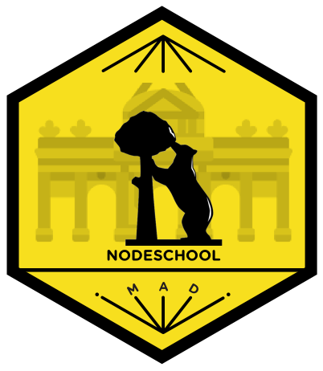

# NodeSchool en Madrid

¿Quieres aprender Node.js? ¡Éste es el sitio!
En colaboración con <a href="http://www.meetup.com/Node-js-Madrid/">Node.js Madrid</a>
hemos organizado una rama local de [NodeSchool](http://nodeschool.io/).

## Eventos presenciales

Los eventos presenciales son una parte importante de NodeSchool,
para animar a más gente a unirse a la comunidad de desarrolladores de Node.js.

Vente con tu portátil y Node.js instalado.
Ayuda que traigas los [tutoriales](http://nodeschool.io/#workshoppers)
instalados, en caso de que nos falle la WiFi.

Y por favor, ayúdanos a difundir el evento entre tus amigos, colegas, conocidos,
clubs de fans, etcétera. Queremos llegar a una audiencia lo más diversa posible.

Si quieres proponer un encuentro, abre un [issue en GitHub](https://github.com/nodeschool/madrid/issues)
o contacta con [@carlosazaustre](https://twitter.com/carlosazaustre).

### Eventos anteriores

El último evento fue en Medialab Prado el 3 de marzo de 2015.
Puedes leerlo [aquí](http://www.meetup.com/Node-js-Madrid/events/220356931/).

### Código de conducta

Usamos este [código de conducta](https://github.com/nodeschool/madrid/blob/master/codigodeconducta.md)
para asegurarnos de que estamos en un entorno libre de conductas abusivas
y que todo el mundo se sienta bienvenido.

## Mentorxs

Toda persona puede ser mentora en NodeSchool Madrid. Sólo apúntate [aquí](https://github.com/nodeschool/madrid/issues/12)

### Slack

Tenemos cuenta en [Slack](https://nodeschoolmadrid.slack.com/),
donde puedes preguntar tus dudas sobre tutoriales concretos,
o comentar lo que quieras en el canal #offline.

## Agradecimientos

Gracias a todos los que han participado, tanto como mentores o como asistentes.

Gracias a la organización de [nodeschool.io](http://nodeschool.io/)
por hacerlo tan fácil y acercar Node.js a miles de personas.

